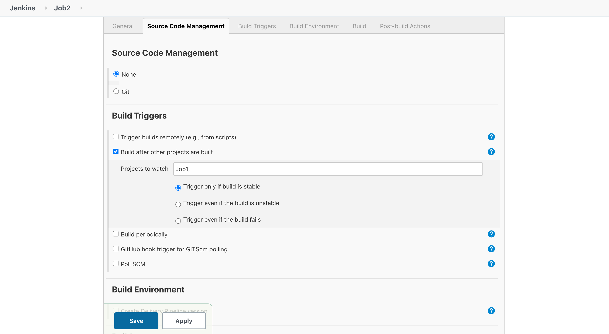

# Automated WebSite Deployment using Docker

In this Project I have used the Git/GitHub, Jenkins and Docker and integrated all these technologies to create an automated system for AutoDeployment. For building this project I have used my another account ie, <a href="https://github.com/Abhinav-26-DevOps/Task-2">Abhinav-26-DevOps</a>, where I practise DevOps tasks.
If you are new to Git/GitHub, Jenkins, WebServer, I have written a well documented article on these topics in my <a href="https://www.linkedin.com/in/abhinavdubey26/">LinkedIn Profile</a> and shown how we can configure these in our system and integrate these technologies. To read the article <a href="https://www.linkedin.com/posts/abhinavdubey26_dockers-dockerimage-automation-activity-6668859867073273856-P6D2">click here<a>.

# How it Works
The Project which I have created is a very basic integration in DevOps Domain. In this Project, when the developer will commit the code, it will automatically push the code in backend to the respective GitHub Repository. Using the WebHooks from GitHub, as soon as the developer pushes the code, it will be send to Jenkins Workspace automatically and then Jenkins Jobs will be triggered automatically as per the Jobs queue. Also I have used the concept of Build Pipeline so that it will be easy to monitor the Jobs.  
<b>Job-1</b> - This Job will copy the Code which GitHub send to Jenkins to the required WorkSpace/folder. 
<b>Job-2</b> - This Job will Launch the Docker Container having the specifications to deploy the website within it. 
<b>Job-3</b> - This Job will be used to test the website weather it is working properly or not. 

And the best thing about all these Jobs is that it all will be automatically triggered as soon as the developer pushes the code to GitHub Repository.

# How to Create this Project
Well it is not as typical as it looks like. If you have good hold in your concepts, then this project is nothing for you. The very 1st thing would be setting up Git, Jenkins and Docker in Your System. For Setting Up Jenkins and Git you can refer to my <a href="https://www.linkedin.com/posts/abhinavdubey26_dockers-dockerimage-automation-activity-6668859867073273856-P6D2">article<a>.Once You set Up Git, Jenkins and Docker you can easly go for creating Your Jobs and if you don't knwo how to create jobs you can read the above article where I have explained in a detailed way of creation of jobs in jenkins or you can watch this <a href="https://www.youtube.com/watch?v=CRvzphqTtU4">video</a>. 
In Job-1's execute shell write 
  <code>sudo cp -rvf * /name_of_your_WorkspaceFolder</code> and then save it.  
In Job-2's execute shell write, 
  <code>if sudo docker container ls | grep production</code> 
  <code>then</code> 
  <code>sudo docker conatiner rm -f production</code> 
  <code>else</code> 
  <code>sudo docker dun -dit -p 8081:80 -v/name_of_your_WorkspaceFolder:/usr/local/apache2/htdocs --name production httpd</code> 
  <code>fi</code> and then save it and go and create Job-3  
In Job-3's execute Shell write 
  <code>status=$(curl -o Your_SysIP:8081/)</code> 
  <code>if[[ $status == 200 ]]</code> 
  <code>then</code> 
  <code>echo "Successfull"</code> 
  <code>exit 0</code> 
  <code>else</code> 
  <code>echo "Error"</code> 
  <code>exit 1</code> 
  <code>fi</code> and then save it and come out of Job-3  
  
After Writing the codes, the next task will be to link all these using build Pipeline so that at one go all will Jobs run and and it will be easy to monitor. Before creating build ppipeline we need to set <b>build triggers</b> such that when Job1 will run, automatically it will triggered Job2 and Job3. <b>Job1 --> Job2 --> Job3</b> 
Here is the image I have attached so that You can easly set the triggers. Please note that trigger is set as per the basis of UpStreams and DownStreams. In this I will setupp the trigger to Job2 such that, as soon as Job will successfully run, it will trigger to Job2 and similarly as Job2 will run successfully it will trigger to Job3 and hence it will create CI/CD.  
 

Now as you have set the triggers, to each job, now it's time to create a pipeline so that we can easliy manage the whole CI/CD Pipeline. If you don't know how to set-up Build pipeline, then you just need to download the <b>Build Pipeline Plugin</b> from Plugin Manager in Jenkins and then I have uploaded the images for your convienent in image folder with names pipeline-1 and pipeline-2 for creating a pipeline for any project. If all the three Jobs will run succesfully then you will get green color in every Job as you can see in the below picture. 

 
 
So this was all about the Project. I hope you understood the Project and if any doubt feel free to ping me on my <a href="https://www.linkedin.com/in/abhinavdubey26/">LinkedIn Handle</a>. To watch the demonstration of the Project <a href="https://www.linkedin.com/posts/abhinavdubey26_dockers-dockerimage-automation-activity-6668859867073273856-P6D2">click here</a>.
