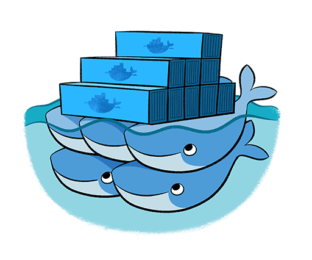

# Containerization Within Container

In this Project I have used the concepts of Docker which I learned during the Training <a href="https://www.linkedin.com/posts/abhinavdubey26_docker-expertise-activity-6675343126288244737-TgyB"><b>Expertise in Docker</b></a> under the guidance of <b>World Record Holder Vimal Daga</b> sir. I have used these concepts to create an <b>Automated WebSite Deployment</b> as I have created in the <a href="https://github.com/Abhinav-26/DevOps-Integration/tree/master/DevOps%20Project-2">Previous Project</a>.

# How it is Different?
This Project, and the Project which I made in previous repository performs the same tasks but with a different approach. The advantage of using this apprach is that we can easily ship this complete project to where ever we want to run it. I have created a Jenkins-image using DOCKERFILE so that all my work will be saved into this and it won't effect my project. Also I have uploaded this jenkins-image to my <a href="https://hub.docker.com/u/alex43">DockerHub</a> profile. 

# How to Launch this Project?
As a pre-requisites of this Project docker must be installed in your system and nothing else required. Run the Following commands in your terminal to launch this project. 
1. <code>docker pull alex43/jenkins-os:v1.0</code>  
2. <code>docker run -dit -p 1234:8080 -v /:/host -v /var/run/docker.sock:/var/run/docker.sock --name automation_project alex43/jenkins-os:v1.0</code>  
3. <code>Your_IP:1234</code>, Enter your Ip with port specified in browser after running container successfully.

For more details about this Project you can see this <a href="https://www.linkedin.com/posts/abhinavd26_containerization-within-container-activity-6671002631571431424-HclV">LinkedIn Post</a> where I have mentioned all the details regarding this Project and written a well documented article for using this concept of Docker-within-docker. 
For any query feel free to dm in my LinkedIn Handle.
